<p align="center">
  
</p>

<p align="center">
  <a href="https://github.com/KERNlang/nero-spec/actions/workflows/ci.yml"></a>
  <a href="https://github.com/KERNlang/nero-spec/releases"></a>
  <a href="LICENSE"></a>
</p>

# Nero Spec

A spec skill for AI coding agents. Before anything gets built, it writes a short spec, and a critic attacks that spec. Plain markdown: Claude, Codex, Antigravity (agy) or a human can follow it. Invoked as `/spec`.

The name comes from its sibling [Agon](https://github.com/KERNlang/agon), a multi-AI orchestration CLI whose `agon nero` is the default critic. No Agon installed → a fresh-context subagent takes the critic's seat and catches as many bugs (see Benchmark).

## How it works

```
task ─▶ spec ─▶ critic attacks it ─▶ fix ─▶ build ─▶ review ─▶ done
         │                                                    ▲
         └── every claim tagged VERIFIED / ASSUMED / OPEN ─────┘
             every acceptance criterion is proven at the end
```

1. **Spec** — what changes, what already works, the contract, acceptance criteria, tricky inputs.
2. **Critic** — an independent reviewer tries to break the spec before any code exists.
3. **Build, then converge** — each criterion ends PASS with test output, or is named as a gap. DONE only when all are checked.

## What's different

- **Short by design** — about 180 lines per spec; a small fix gets half a page.
- **Critic built in** — no spec is approved until an independent reviewer has attacked it.
- **Modular** — a small core plus addons that load only when their step comes up, switched per repo in `.spec`. A new addon is one markdown file plus one table row.
- **Claims carry evidence** — every claim is tagged VERIFIED, ASSUMED or OPEN; at most 3 OPEN per spec.
- **Plain markdown** — any agent or human can follow it; no CLI or IDE required.

## Quick start

```sh
./install.sh           # links the skill into the agents found on this machine
```

Works on macOS, Linux and Windows (Git Bash or WSL; see [Windows](docs/REFERENCE.md#windows)).

Then, in your agent:

```
/spec add rate limiting to the login endpoint
/spec init             # optional: set a preset and addons for this repo
```

## Building blocks

- **Core** (`skill/core.md`) — the flow above, the same for everyone.
- **Presets** — `personal`, `team` or `enterprise`: which addons are on, and the house rules (commits, reviews, which AI vendors may see the code).
- **Addons** — one concern each (contract checks, drift checks, test mapping, Jira tickets, …). They load only when their step comes up. Switch one on or off per repo in `.spec`: `addons: +contested-decision-scan, -issue-link`.

## Benchmark

12 real OSS PRs merged June–September 2026 that shipped a bug later fixed by a follow-up commit (aiohttp, caddy, urfave/cli, vue core, django, echo, litestar, rails, react-router, tauri, uv, zod; Go, Rust, Python, Ruby, TypeScript). Each spec is written blind at the PR's base commit, then scored by 2 blind graders (codex, agy) on whether it would have caught that bug (catch 0–3 per case). Table values are the average of both graders, hence the halves.

| Setup | Bugs caught /36 | Lines (all 12 specs) | Specs requiring the bug |
|---|---|---|---|
| **Nero Spec + agon nero** | **27** | **2177** | **1** |
| Nero Spec + agon nero, codex forced as critic | 27.5 | 2193 | 1 |
| Nero Spec + subagent critic | 27 | 2165 | 1 |
| Nero Spec, no critic | 23 | 2097 | 1.5 |

Short specs, about 180 lines each on average. The critic is the biggest single factor: +3 to +5 points for every critic variant and under both graders separately; which critic runs (agy, codex or a subagent) barely matters.

The same 12 cases, other spec frameworks (points /36, no critic → subagent critic):

| Framework | No critic | Subagent critic |
|---|---|---|
| Kiro | 23.5 | 28 |
| **Nero Spec** | **23** | **27** |
| OpenSpec | 19.5 | 24.5 |
| Spec Kit | 19 | 23.5 |

Nero Spec is on par with Kiro and ahead of OpenSpec and Spec Kit, with far fewer spec lines. Most of the gain comes from the critic, not the template: a control run (plain spec writer vs Nero Spec, same critic) showed no clear added benefit beyond run-to-run noise.

**1:1 build pilot vs Spec Kit** ([report and data](bench/2026-09-29-nero-vs-spec-kit/)) — one Go task on urfave/cli, same model, each framework took it from spec to working code, checked by a hidden test. Both passed. Spec Kit's first pass panicked on a valid edge case and needed a repair round; Nero Spec's first pass did not. Nero Spec wrote 1 spec file (118 lines) vs Spec Kit's 10 files (321 lines), but took about twice the wall time (20.5 vs 9 min) because of the critic calls. One case: it shows the approach holds up, not a ranking.

Caveats: every benchmark case is a PR that shipped a bug, so this measures recall only, not false alarms on harmless changes. 12 cases with one spec run each, and a single case can swing by 2.5 points between runs. The grading rubric and critic prompt were written by the same author as the framework, and the nero critic engine was also one of the graders.

## More

- [docs/REFERENCE.md](docs/REFERENCE.md) — presets and addons in full, config files, spec lifecycle, drift checks, install options, writing an addon.
- [CONTRIBUTING.md](CONTRIBUTING.md) — how to send changes · [CHANGELOG.md](CHANGELOG.md) · [SECURITY.md](SECURITY.md).
- License: [MIT](LICENSE).
